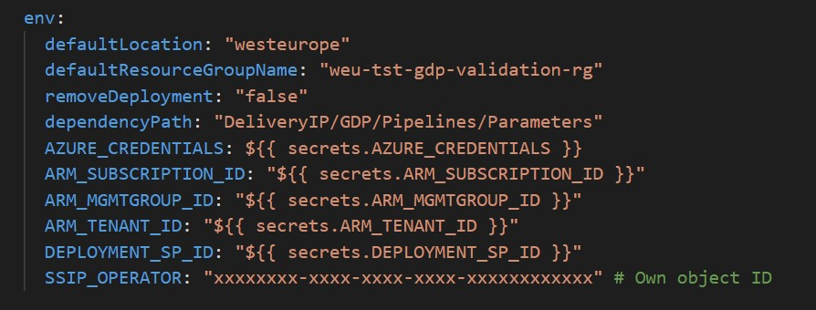
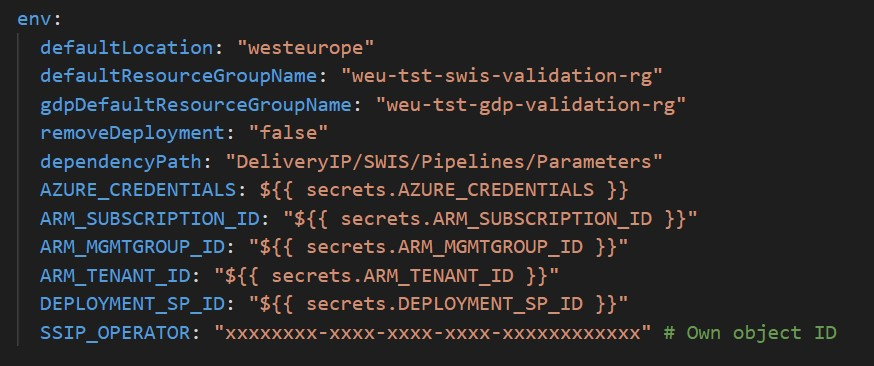

# Deployment guide
This deployment guide is to be used for the steps to take in order to deploy the infrastructure. It will walk through all the necessary steps to get the solution deployed.

## Prerequisites
- Azure subscription with Owner or Contributor rights and ability to create Service Principals and Resource Groups.
- VS Code with the Azure Resource Manager and Bicep Tools extension installed.
- Azure CLI installed. (https://docs.microsoft.com/en-us/cli/azure/install-azure-cli)
- Git installed. (https://git-scm.com/downloads) and git knowledge.
- You need to clone the repository.
- Enable GitHub Actions for the repository. (https://docs.github.com/en/actions/learn-github-actions/enabling-and-disabling-github-actions) and Github and Azure credentials configured. (https://docs.microsoft.com/en-us/azure/developer/github/connect-from-azure-devops?tabs=personal-access-token).

## Deployments steps

Create GitHub secret in addition of the "Azure Credentials" as following:
"ARM_SUBSCRIPTION_ID", "ARM_TENANT_ID", "ARM_CLIENT_ID", "CLIENT_SECRET" and "DEPLOYMENT_SP_ID".
(https://docs.github.com/en/actions/reference/encrypted-secrets).

Once that the GitHub setup is done, we can move forward with the infrastructure deployment.

### Deploying the GDP infrastructure

Setup the environment variables for the pipelines trough this yml file for GDP .github\workflows\platform.gdp.yml

"default location" and "default resource group" are the default values for the deployment. You can change them if you want to deploy the infrastructure in a different location or resource group name.

Then go trough DeliveryIP\GDP\Pipelines\Parameters and update the parameters files with the values that you want to use for the deployment.

For each resources you have to update required parameters into the parameters files with the values that you want to use for the deployment as following:

| Resources          | Parameters |
| -----------        | ----------- |
| Key Vault          | Required: "Name", "TenandId" and "ObjectId".   |
| SQL                | Required: "administratorLogin" (ID of the KeyVault created), "administratorLoginPassword" (ID of the KeyVault created), "Name" and "DatabaseName" .    |
| Storage Account    | Required: "Name" (need to be done for each storage).     |
| Synapse Workspace  | Required: "Name", "defaultDataLakeStorageAccountName", "defaultDataLakeStorageFilesystem", "administratorLogin" (ID of the KeyVault created) and "administratorLoginPassword" (ID of the KeyVault created) .        |

Once that the files are updated, you can start the deployment by clicking on the "Actions" tab and then on the "platform.gdp" workflow. Then click on the "Run workflow" button.

### Deploying the SWIS infrastructure

Setup the environment variables for the pipelines trough this yml file for SWIS .github\workflows\platform.swis.yml

"default location" and "default resource group" are the default values for the deployment. You can change them if you want to deploy the infrastructure in a different location or resource group name.

Then go trough DeliveryIP\SWIS\Pipelines\Parameters and update the parameters files with the values that you want to use for the deployment.

For each resources you have to update required parameters into the parameters files with the values that you want to use for the deployment as following:

| Resources          | Parameters |
| -----------        | ----------- |
| Key Vault          | Required: "Name", "TenandId" and "ObjectId".   |
| SQL                | Required: "administratorLogin" (ID of the KeyVault created), "administratorLoginPassword" (ID of the KeyVault created), "Name" and "DatabaseName" .    |
| Synapse Workspace  | Required: "Name", "defaultDataLakeStorageAccountName", "defaultDataLakeStorageFilesystem", "administratorLogin" (ID of the KeyVault created) and "administratorLoginPassword" (ID of the KeyVault created) .        |

Once that the files are updated, you can start the deployment by clicking on the "Actions" tab and then on the "platform.gdp" workflow. Then click on the "Run workflow" button.