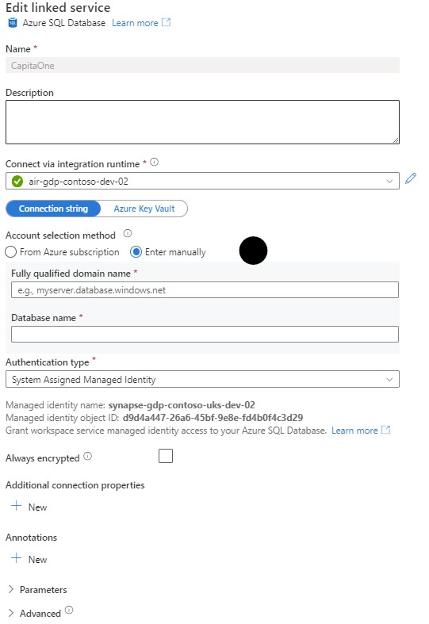
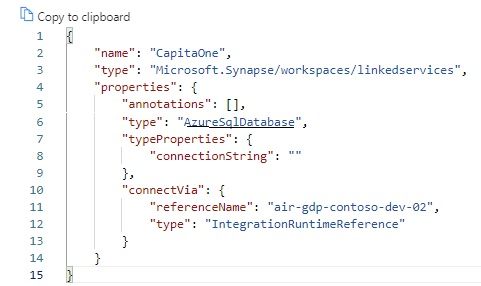
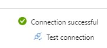
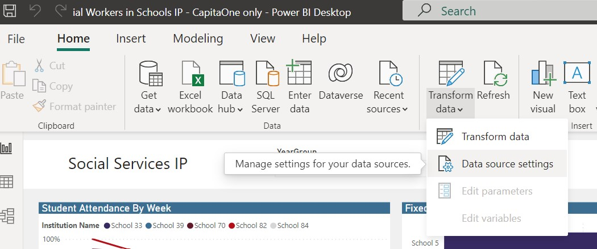
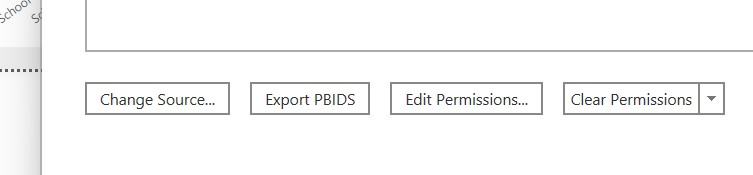
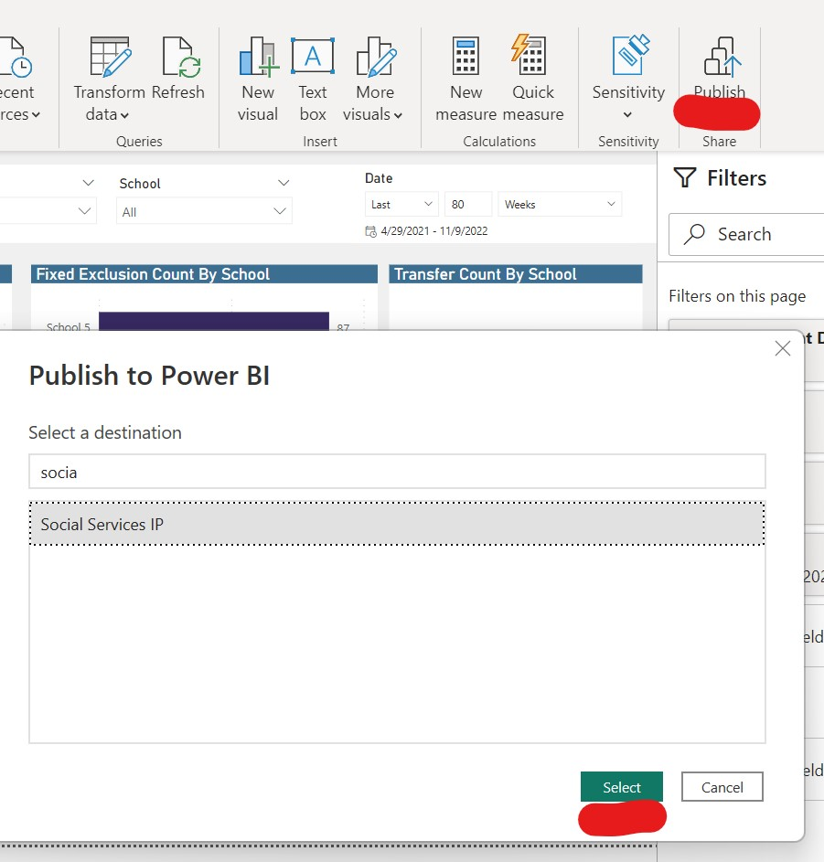
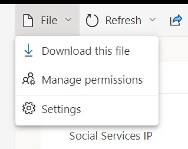
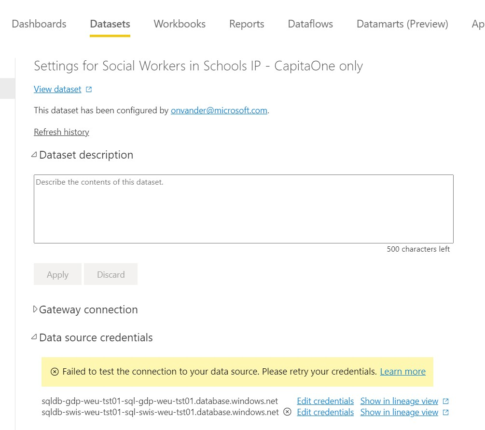

# Implementation guide 
This implementation guide is to be used after successfully running the infrastructure deployment. It will walk through all the necessary steps to get the solution up and running. 

## Prerequisites
- The GDP Synapse workspace managed identity has access to the CapitaOne database
- The infrastructure deployment of both GDP and SWIS is successfully completed
- Whitelisted IP address on GDP and SWIS Synapse workspaces and SQL Servers 
- The user whose clientId is filled in the workflows as 'SSIP_OPERATOR' should perform the implementation tasks
- You have a PowerBI Pro (or Premium) license and a set up a Workspace for the Social Service solution
- You have installed Power BI Desktop

## GDP Setup
Setup of the Global Data Platform (GDP) Synapse workspace 
### CapitaOne (and LiquidLogic) data sources
The CapitaOne data source should be connected in the Linked Services in Synapse Studio. By default it is now configured as a Azure SQL DB. The preferred details can be filled in in the text boxes. 

When the linked service type should be changed, it is advised to manually do this in the JSON source code of the Linked Service.

The same goes for LiquidLogic if applicable, yet, not supported for now. 

### Linked Services Double check
It might be wise to check for every Linked Service to check whether the connection is made successfully. One can do that through the 'Test Connection' button when looking at the details of each linked service. The connection and access should be made automatically, but in some cases it might fail due to org-specific policies. When the connection fails, please check the managed identity access on the resource and resource details.

### Create containers in raw and refined ADLS
In both of the deployed ADLS Gen2 for raw and refined, create the containers called: 'raw' and 'refined' in the respective ADLS resources. Also, add a container called 'schools' in the raw storage account (so not ADLS).

### Start all triggers in GDP
Hit the start button for each and every trigger and publish the changes.

### Insert into the SQLPullQueries table
Run the `DeliveryIP/GDP/CodeBase/sql/metrics.SqlPullQueries.data.sql` in the GDP SQL Database. For line 19, please take into account that the current start date is set at 2020-07-01, but can be adjusted in order to attendance data from a certain date onwards. The query editor in the Azure Portal can be used to run the query.

### Upload Schools excel sheets
Upload the Schools excel sheets into the the raw storage account in the schools container. The excel sheets can be found under `DeliveryIP/GDP/CodeBase/sql`. But first, the excel sheets for `CityMasterSchoolInformation.xlsx` should be updated with the accurate school information, rather than the dummy names now. For the `Terms.xlsx` file, adjust to the actual school terms of the schools. The `InternalReferenceData.xlsx` can be kept as is. Automatically, the schools files should now be transferred to raw, and even to refined. Take a break and wait until the flow to refined is done.

### Run CapitaOne Raw pipeline 
The CapitaOne Raw pipeline should be ran now. What will happen is that the raw ADLS Gen2 will be filled with the raw data, and automatically the data flows are triggered to take the data into the refined layer. 

## SWIS Setup
Now the data is in a refined state on the Global Data Platform, one can continue to deploy the Social Workers in Schools solution. 

### Linked Services Double check
Also for SWIS, it might be wise to check for every Linked Service to check whether the connection is made successfully. One can do that through the 'Test Connection' button when looking at the details of each linked service. The connection and access should be made automatically, but in some cases it might fail due to org-specific policies. When the connection fails, please check the managed identity access on the resource and resource details.

### Set the time trigger for SWIS load 
In case both CapitaOne and LiquidLogic are used, active the PipeSwis Trigger on a preferred schedule. If only CapitaOne is activated, create a new time-scheduled trigger for the pipe_CapitaOne. Trigger the pipeline manually to do a first run or wait for the timetrigger to run the pipeline.

## Power BI Setup
This part explain the data loading and publishing of Power BI
### Opening the right .pbix file
Open Power BI Desktop and load the .pbix file needed. For only CapitaOne deployments, one should take the `DeliveryIP/SWIS/CodeBase/Social Workers in Schools IP - CapitaOne.pbix` file. For both CapitaOne and LiquidLogic, one should take the `DeliveryIP/SWIS/CodeBase/Social Workers in Schools IP - empty dashboard.pbix` file.

### Change the data source connection
In the top ribbon in Power BI, one can find change the data source settings of the report. Change the Azure SQL servername and database name to the corresponding details, and authenticate using you preferred method (AzureAD or password). Do this through the Change Source and Edit Permission buttons.

and

### Publish the Report 
After the data is loaded into the report, you are ready to publish it on your Power BI workspace. Hit Publish and select the corresponding workspace 

### Set credentials and schedule refresh in Power BI service
After published, credentials to authenticate to the SQL Database should be updated. To do so, go to the Power BI dataset and go to File>Settings.

Then, go to Data source credentials and click on `Edit credentials`. One can choose to use SQL Authentication or OAuth, using your AzureAD. For the latter, make sure you have rights to read the data on the SQL databases.

## Congratulations, your SWIS and GDP service is deployed
When facing errors, feel free to open an issue on this GitHub Repo.
