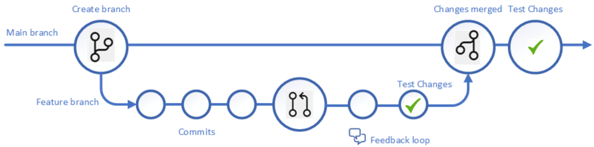
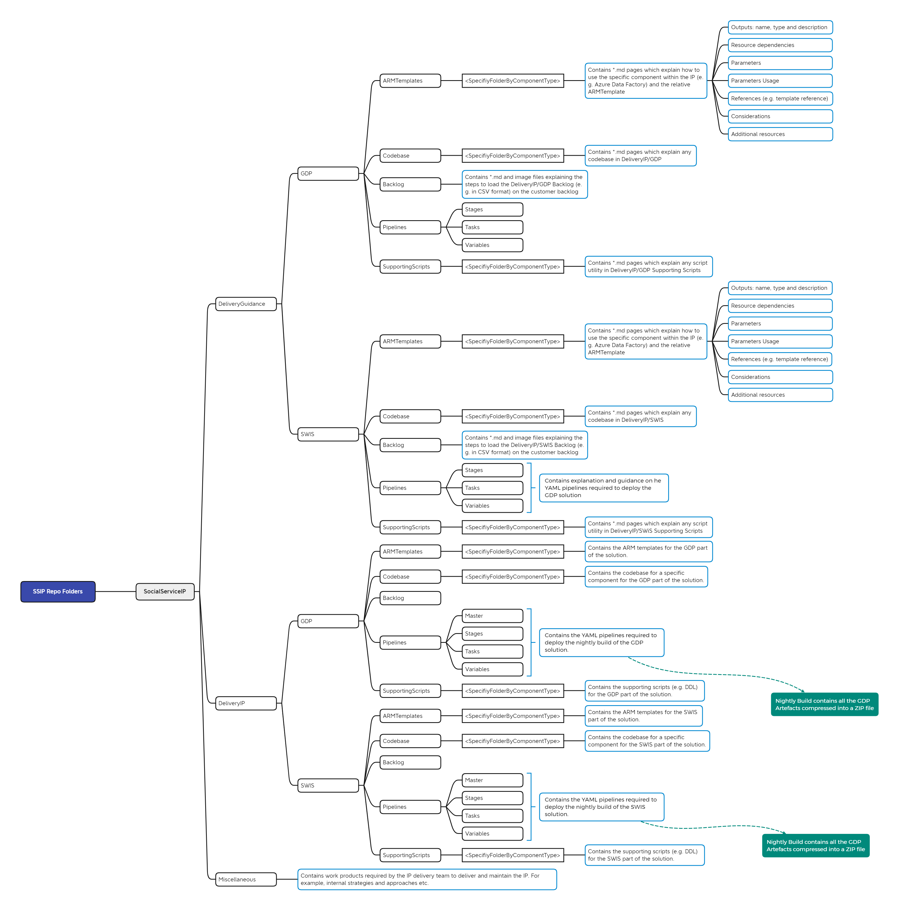

# Branching Strategy

The branching strategy being utilized in the Social Service Delivery IP will be the GitHub flow approach. This
enables the main branch to be kept clean while keeping the workflow simple for developers.

## Workflow
- Developer creates a feature branch from main
- Naming convention to use for new branches is feature/<name>_<UserStoryNumber>. For example feature/marco_12345
- Developer makes their commits in their feature branch, ensuring good commit messages.
- When the feature is complete a Pull Request is initiated
- Pull Request should be peer reviewed by another developer and feedback provided
- Automated testing should be done where appropriate before merging to main
- Code is merged to main
- Code is tested before promoting to higher environment / production
- Feature branch should then be deleted

## Policies
A branch policy is created to ensure that no changes are made directly to the main branch, and to ensure
that there is at least 1 reviewer for a pull request.

# Repo Physical Structure
## Repository high-level folders strategy
The repo comprises three main sections:
- DeliveryGuidance
- DeliveryIP
- Miscellaneous

The DeliveryGuidance folder contains mainly work products describing how to leverage the various components of the IP to implement it as an accelerator within Customer engagements.

The DeliveryIP folder contains the IP. The IP comprises the following work packages:
- Documentation of the solution from a business/technical user perspective
- ARM Templates
- 

The Miscelanous folder contains work products required by the IP delivery team to deliver and maintain the IP. For example, internal strategies and approaches etc.

## Repository low-level folders strategy
This section describes the folders structures and their use within the SocialService IP at a granular level. The pictorial below contains the hierarchy, naming, and description of the IP GitHub repo folders.

